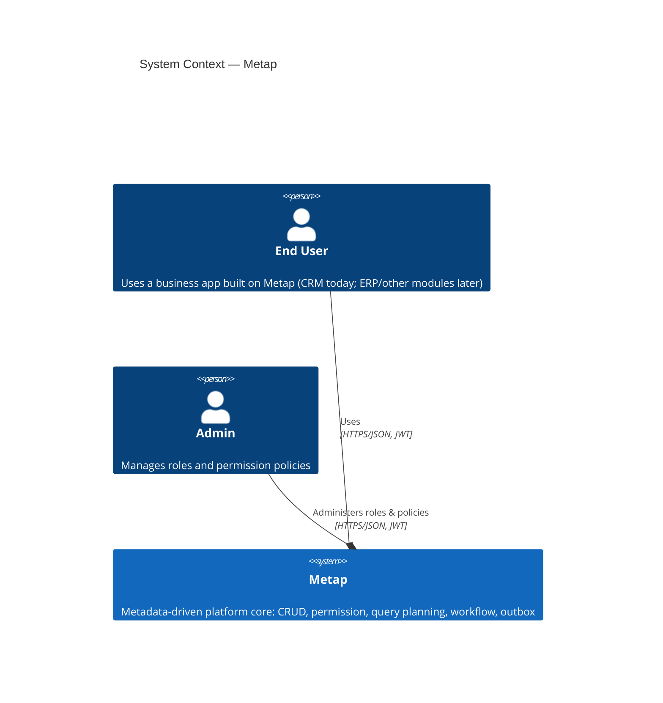

# 3. System Scope and Context

## Business Context

| Actor | Interaction |
|---|---|
| End User | Uses a business app built on Metap (CRM today) — creates/reads/updates records, lists/filters/searches, runs workflow transitions |
| Admin | Grants/revokes roles per user, manages field- and record-level permission policies, via the admin-gated `/admin/*` HTTP routes (`crates/metap-http/src/routes/admin.rs`) |

Out of scope today: no external system integrations exist (no payment gateway, no email/notification provider, no third-party identity provider beyond verifying externally-issued JWTs). Metap is verify-only for auth — it does not issue tokens itself in production (a dev-only `pnpm mint-token`/`dev-tools mint-token` command exists for local testing).

## C4 Level 1: System Context

Metap has no external system integrations yet (no payment/email/notification providers) — the only actors today are end users and admins of whatever business app is built on top of it.

## Technical Context

- **Protocol**: REST over HTTPS, JSON bodies, `Authorization: Bearer <JWT>`.
- **Auth**: Metap verifies externally-issued JWTs (RS256, public key configured via `AUTH_JWT_PUBLIC_KEY_PATH`) — it does not mint tokens for production use. Roles are *not* carried in the JWT; they're looked up fresh per request from `user_roles` (see [05. Building Block View](05-building-blocks.md)).
- **Errors**: structured JSON error bodies with a request id and trace id (`crates/metap-http`).
- **Events out**: RabbitMQ, AMQP 0-9-1, via the transactional outbox — no synchronous webhook/callback mechanism exists.
