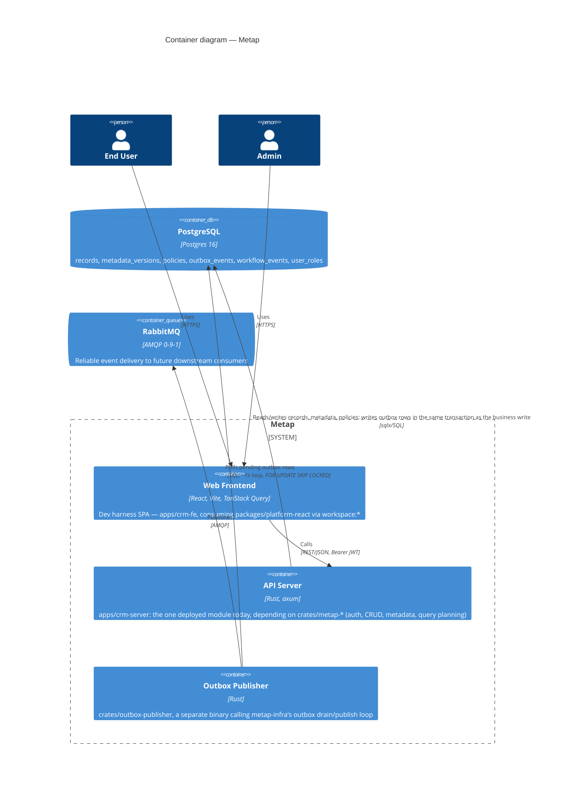
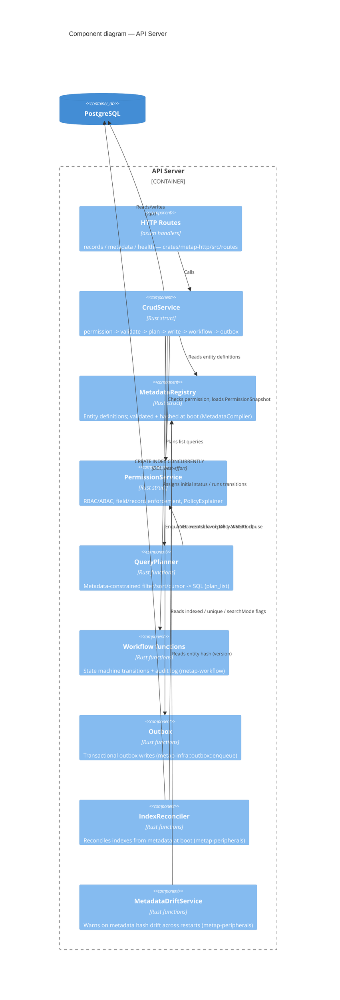
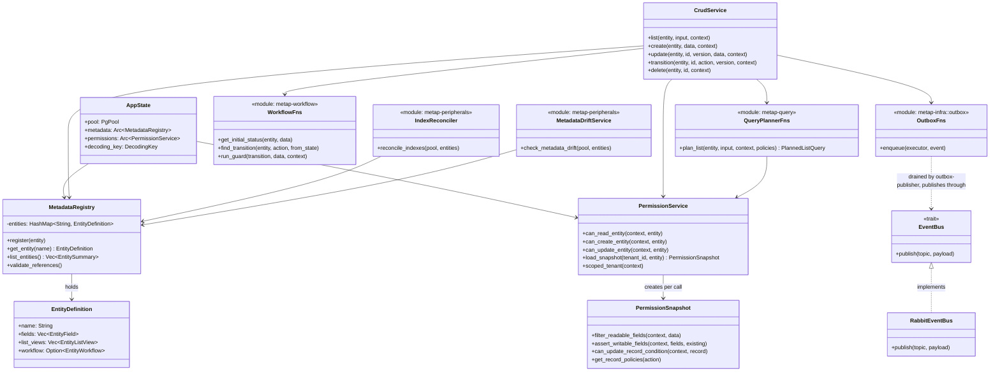
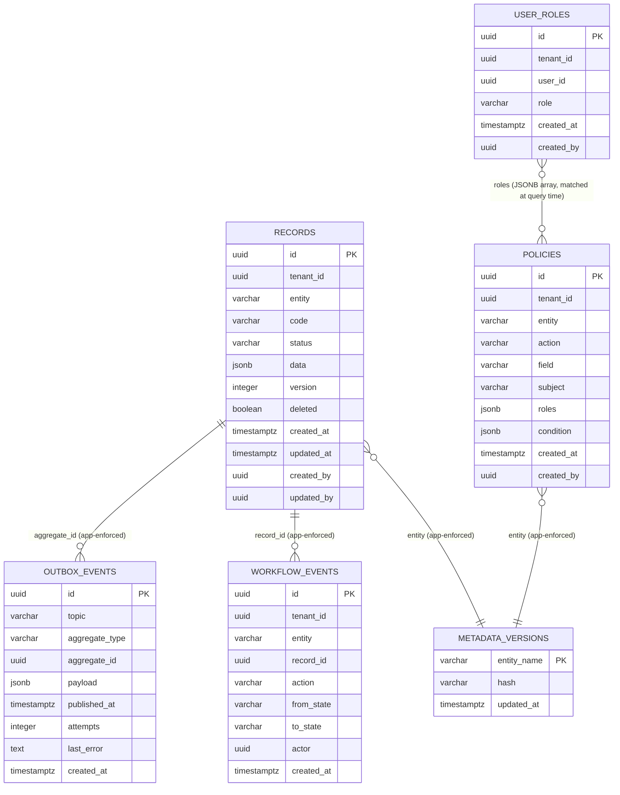
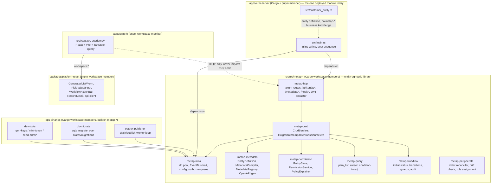

# 5. Building Block View

## High-level Layers

```txt
axum routes (crates/metap-http/src/routes/*)
  -> application service (crates/metap-crud/src/crud_service.rs)
    -> platform core (metap-metadata / metap-permission / metap-query / metap-workflow)
      -> PostgreSQL (sqlx::PgPool, injected directly — no repository abstraction; see
         docs/architecture-review-2026-08-07.md Part 1's Repository finding for why)
      -> outbox (metap-infra::outbox::enqueue) -> RabbitMQ (metap-infra::EventBus)
```

## C4 Level 2: Containers



The API Server and the Outbox Publisher are deliberately separate processes (`pnpm dev:rs` vs `pnpm worker:outbox:rs`) — a RabbitMQ outage stalls the worker, never the API, because the transactional outbox write already committed. `apps/crm-server` can optionally also serve `apps/crm-fe`'s built static files from the same process/port (`pnpm start`, `STATIC_DIR` config) — a deployment convenience, not a change to this separation; the worker stays a distinct process either way.

## C4 Level 3: Components (inside the API Server)



## Logical View (class-level)

The object model behind the component diagram above — types and how they depend on each other, not deployable units. (Kruchten 4+1's Logical View.) `metap-query`/`metap-workflow` are function modules rather than structs (no per-call state to hold), shown here as pseudo-classes for consistency with the rest of the diagram.



## Whitebox: Core Services

### Metadata Registry

Owns entity definitions:

- fields
- list views
- workflow
- index/search/sort hints

Metap validates and compiles metadata as a first-class runtime artifact rather than treating it as a passive schema description. `MetadataCompiler` enforces this at `MetadataRegistry::register()` time — duplicate fields, dangling listView field/filter/sort references, missing enum values, and malformed workflow shape all fail startup, not the first request. Each entity gets a deterministic hash of its shape (`MetadataCompiler::hash`, guard conditions excluded) exposed as `version` on `GET /metadata/entities`; a `MetadataDriftService` compares that hash against the last-recorded one on every boot and warns — never crashes — on drift, mirroring the health check's graceful-degradation stance. The same safe metadata projection also drives a generated OpenAPI document at `GET /metadata/openapi.json` (hand-written in `metap-metadata/src/openapi.rs`, kept in sync with `entity.rs`'s structs by hand — there's no Zod-equivalent runtime-reflection step in Rust).

### CRUD Service

Generic CRUD for metadata entities (`metap-crud::CrudService`), the only thing routes call for record operations.

Responsibilities:

- validate data with the field-metadata-driven validator (`metap-crud/src/validation.rs`, replaces per-entity Zod schemas — there's no separate hand-authored validation-schema object)
- enforce permission through `PermissionService`
- call the query planner (`metap-query::plan_list`) for list/search
- persist records
- enqueue outbox events
- call the workflow functions where needed

### Permission Service

The permission layer (`metap-permission::PermissionService`) owns:

- tenant scope
- role assignment — dynamic, DB-backed per `(tenant_id, user_id)`, granted/revoked at runtime through the admin-gated HTTP API (`crates/metap-http/src/routes/admin.rs`, wrapping `metap-peripherals::assign_role`/`revoke_role`/`list_users`); the JWT itself is a bare identity assertion, not a role carrier
- policy storage — a role allow-list combined with an optional attribute condition (`PolicyCondition`), OR-combined across matching policies, no deny rules, behind the `PolicyStore` trait (`PostgresPolicyStore` is the only implementation today)
- field-level permission — read masking and write gating, wired into every `CrudService` call site (`list`/`create`/`update`/`transition`)
- record-level permission — attribute conditions translated into a `WHERE` clause (`metap-query::condition_to_sql::record_policy_where_clause`) and ANDed into `plan_list` for reads, plus a same-shape check before writes
- policy explanation/debugging — `PolicyExplainer` produces a read-only trace of every policy considered and why, exposed as the admin-gated `POST /admin/policies/explain` simulator endpoint
- a per-call `PermissionSnapshot` batches a tenant/entity's policies into one DB fetch reused across a single `CrudService` call — deliberately not a cross-request/TTL cache

Started as a scaffold that allowed everything so the architecture could boot (in the original TS codebase); the service boundary was fixed from day one and the real logic above now fills it in, reimplemented 1:1 in the Rust port.

### Query Planner

`metap-query::plan_list` turns safe view/query contracts into SQL — the *only* place list/filter/sort queries are turned into SQL.

Rules:

- every list has a max limit
- every business query includes tenant scope
- frontend cannot send arbitrary database query operators
- filter/sort fields must be declared in metadata
- expensive reports use dedicated report services or background jobs (deferred, trigger-based — see [11. Risks and Technical Debt](11-risks.md))

Built on top of that baseline:

- **Hot field indexes.** `EntityField.indexed`/`unique` drive `IndexReconciler` (`metap-peripherals`), which reconciles per-entity partial expression indexes on `records` automatically at boot (`CREATE INDEX CONCURRENTLY IF NOT EXISTS`, best-effort) and via a manual `pnpm index:reconcile`-equivalent invocation. The indexed expression must byte-for-byte match the query's own filter/sort expression (`jsonb_extract_path_text`, not the semantically-equivalent `->>` operator) or Postgres never selects it.
- **Full-text search.** `EntityField.searchMode: "fts"` (opt-in; default stays substring/ILIKE) matches via `to_tsvector('simple', ...) @@ plainto_tsquery('simple', ...)`, backed by a GIN index — same `IndexReconciler` mechanism as above.
- **Keyset pagination.** An opaque, base64-encoded cursor (`metap-query/src/cursor.rs`, never interpreted by the client) is validated against the *resolved* sort (post-fallback) and turned into a keyset `WHERE` condition; a cursor for the wrong sort, or a malformed one, is a `400`, never silently accepted or a `500`.

### Workflow Functions

Workflow is metadata-driven (`metap-workflow`, free functions rather than a struct — no per-call state to hold):

- state field
- initial state
- terminal states
- transitions
- actions

Transitions are atomic operations with optimistic locking (a version-mismatch write fails the request, not the state), guarded by a `PolicyCondition` — the same declarative shape policies already use (`metap-permission::PolicyCondition`), not a function, since Rust has no server-side-predicate-function equivalent to port from the original TS design (see `metap-metadata::entity::WorkflowTransition`'s doc comment for the reasoning). Every transition is logged to an append-only `workflow_events` audit table and emits a `<entity>.workflow.transitioned` outbox event after commit — side effects only ever flow through the outbox, never a direct publish.

### Outbox + EventBus

API transactions write outbox rows in PostgreSQL (`metap-infra::outbox::enqueue`, same transaction as the business write). A publisher (`outbox-publisher`, a separate binary) drains rows and publishes to RabbitMQ through the `EventBus` trait (`metap-infra::EventBus`; `RabbitEventBus` is the only implementation today) — publishing is behind an interface from the start in the Rust port, unlike the original TS codebase where this was a documented gap (see `docs/architecture-review-2026-08-07.md`'s Event finding, superseded by this).

This protects the system from losing business events when RabbitMQ is temporarily unavailable.

## Data Model

Metap starts with a generic `records` table:

- stable columns for system-level fields
- `data jsonb` for metadata-driven business fields
- tenant/entity/status indexes
- version column for optimistic locking

This preserves metadata-driven development speed. Over time, high-volume or accounting-critical modules can get dedicated typed tables while still using the same metadata facade.

Recommended evolution:

```txt
Step 1: generic records + JSONB (done)
Step 2: metadata-driven indexes for hot fields (done — see Query Planner
        above; shipped as per-entity partial expression indexes generated
        by IndexReconciler, not physical generated columns — a shared
        `records` table can't grow one column per possible field name
        across every entity without its column count growing unboundedly)
Step 3: dedicated tables for accounting/inventory critical paths
Step 4: report/materialized views for heavy analytics
```

Steps 3-4 are not built and have no trigger yet — see [11. Risks and Technical Debt](11-risks.md).

### Database Design (ER diagram)

Six tables (`crates/migrations/*.sql`, applied via `db-migrate`'s `sqlx::migrate!`), no cross-table foreign key constraints — `tenant_id`/`entity`/`aggregate_id`/`record_id` are plain columns whose relationships are enforced by application code (`QueryPlanner`, `CrudService`), not the database schema. This is deliberate: `records` is one generic, entity-agnostic table, so a real FK from e.g. `workflow_events.record_id` to `records.id` would work today but would have to be dropped the moment any single entity gets peeled off into its own dedicated table (Step 3 above) — not before its trigger.



Notes:

- `records.data` is the metadata-driven payload; `code`/`status` are denormalized top-level columns that mirror two fields inside `data` (`code` always, `status` mirrors `entity.workflow.stateField`'s value) purely so they can be indexed/queried as real columns.
- `outbox_events`/`workflow_events` reference `records` rows by id (`aggregate_id`/`record_id`) but across the *whole* generic table, not a per-entity table — one outbox table serves every entity.
- `policies.roles` is a JSONB array matched against a caller's roles at evaluation time (`role_gate_passed`), not a relational join to `user_roles`.
- Real indexes beyond the primary keys shown above are covered in "Hot field indexes"/"Full-text search" above — those are per-entity partial expression indexes generated from metadata, not part of this fixed schema.

## Service Boundaries

Do not let HTTP, `sqlx`, RabbitMQ, and metadata logic leak everywhere.

Allowed dependencies:

```txt
routes -> services
services -> metadata / permission / query / workflow / outbox
metap-infra -> database / messaging
apps/crm-server -> crates/metap-* — never the other way around
```

Avoid:

- route/handler code importing `sqlx`/`lapin` directly
- frontend query operators mapping directly to SQL
- workflow handlers publishing RabbitMQ directly
- authorization living only in frontend or gateway config

### Development View (workspace organization)

The same dependency rule above, visualized as workspace members (Kruchten 4+1's Development View). This repo overlaps two workspace systems at `apps/`: a Cargo workspace (root `Cargo.toml`) for the backend, a pnpm workspace (`pnpm-workspace.yaml`) for the frontend — each box below is a real package/crate with its own manifest, not just a source-tree folder.



`apps/crm-server` depends on `crates/metap-*`; no `metap-*` crate has a dependency path back to `apps/crm-server` or any other `apps/*` package — that direction is what keeps `metap-*` genuinely entity-agnostic, not just conventionally so. `apps/crm-fe` is the frontend's equivalent: it can only ever reach the backend over HTTP (the dotted line), never by importing backend code, and it consumes `packages/platform-react` the same way `apps/crm-server` consumes `crates/metap-*`.
