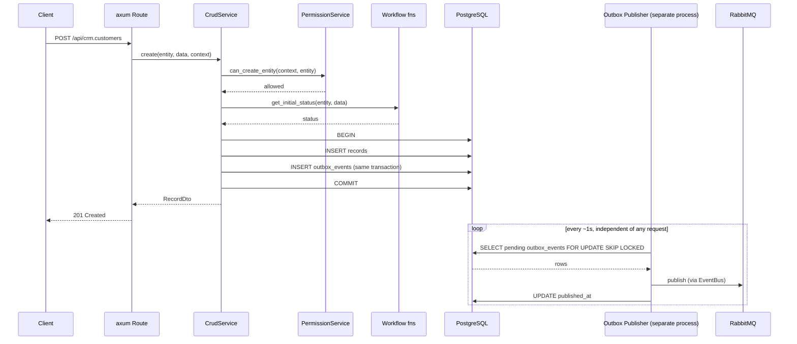

# 6. Runtime View

## Concurrency: two independent processes

The API Server and the Outbox Publisher are connected only through PostgreSQL (the transactional outbox) and RabbitMQ — never a direct call. The sequence below shows a `create()` request (API Server process) and the Outbox Publisher's polling loop (separate process) running concurrently. (Kruchten 4+1's Process View.)

If RabbitMQ is down, the loop above just keeps failing and retrying — the `create()` request already committed and returned before the loop ever runs, so API availability never depends on RabbitMQ being up.

## Scenarios

The scenarios that exercise the building blocks above, used as the basis for this codebase's live-DB e2e tests (`cargo test --workspace -- --ignored`, needs `DATABASE_URL` + a running dev Postgres/RabbitMQ). (Kruchten 4+1's "+1" — the scenarios that validate the other views.)

- **Create a record** — `CrudService` → `PermissionService` → workflow fns → outbox `enqueue`, one PostgreSQL transaction. Sequence: above.
- **Update with a stale version** — same path as create, but `CrudService::update`'s `WHERE version = $expected_version` matches zero rows, returning `409 version_conflict` instead of silently overwriting a concurrent write.
- **Workflow transition** — `find_transition` + `run_guard` (a `PolicyCondition` evaluation) gate the state change; on success, an append-only `workflow_events` row is written and a `<entity>.workflow.transitioned` outbox event enqueued in the same transaction as the create scenario.
- **List with filter, full-text search, and keyset pagination** — exercises `plan_list` end-to-end: metadata-constrained filters, the `searchMode: "fts"` branch, the record-level policy `WHERE` clause, and a cursor validated against the resolved sort — all ANDed into one query against the indexes `IndexReconciler` maintains.
- **Admin grants a role** — `POST /admin/users/{userId}/roles` (admin-gated, `crates/metap-http/src/routes/admin.rs`) writes a `user_roles` row via `metap_peripherals::assign_role`; the next request from that user picks up the new role immediately (roles are read fresh per request, never cached in the JWT).
