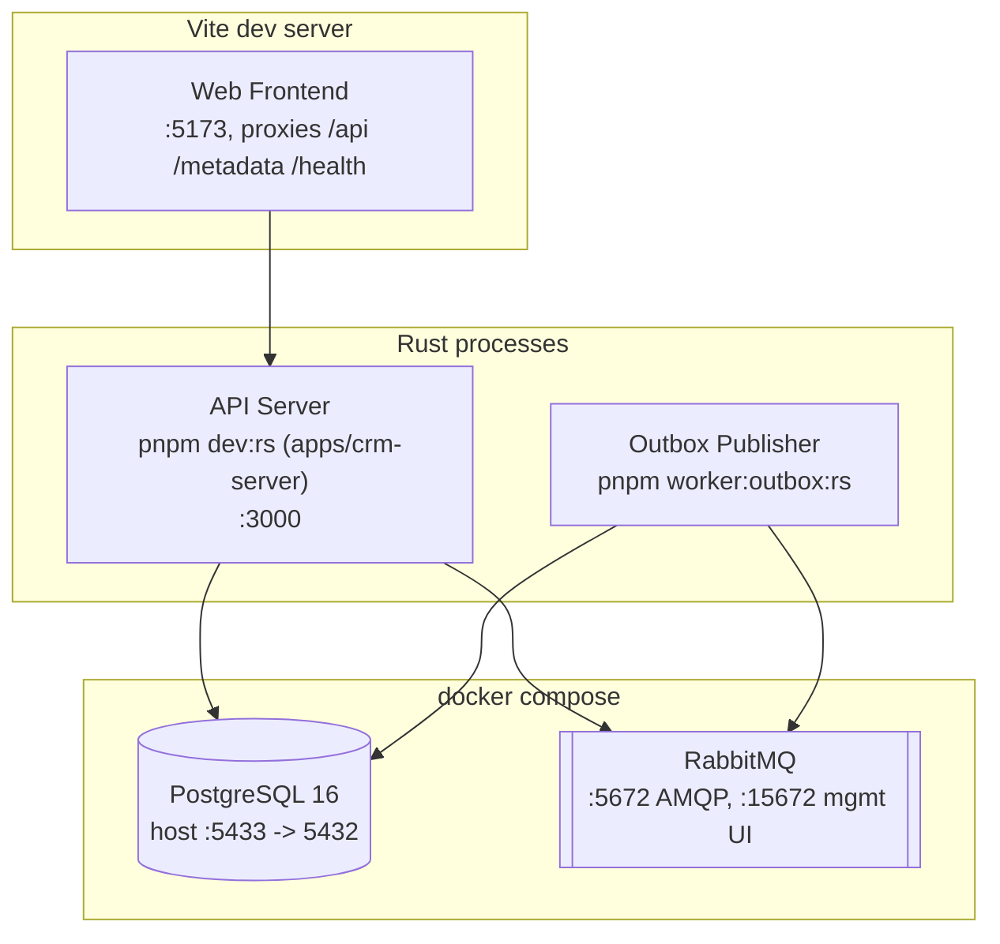

# 7. Deployment View

Deployment topology for local development (`docker compose` + Rust processes run via `pnpm` script wrappers, or `cargo run` directly). Production isn't built out yet ([Phase 8: Hardening](../roadmap.md) is not started) — this reflects today's actual dev setup, not a target production topology. (Kruchten 4+1's Physical View.)

## Notes

- API Server and Outbox Publisher are separate binaries/processes today, not separate containers — either can be containerized independently without code changes, since they already only communicate through PostgreSQL/RabbitMQ.
- **Single-process alternative**: `pnpm start` builds `apps/crm-fe` and points `apps/crm-server`'s `STATIC_DIR` config at the build output, so the API server serves the frontend's static files itself, single-process/single-port. This is a deployment-convenience mode, not a replacement for the split dev workflow above (`pnpm dev:web` + `pnpm dev:rs`) — the Outbox Publisher is never folded into this, it stays a distinct process either way.
- No production deployment topology is documented yet — no orchestrator (Kubernetes, ECS, etc.), no load balancer, no autoscaling, no secrets manager. This is real, tracked debt — see [11. Risks and Technical Debt](11-risks.md).
- `docker compose` here is a local dev convenience, not a deployment target — `docker-compose.yml` only runs `postgres` and `rabbitmq`; the API/worker/frontend all run as plain processes on the host.
